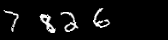
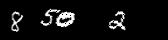

# Data Generation for 4-Digit Number Images using MNIST Digits

## Overview

This project generates a dataset of **2700 images** containing **random 4-digit numbers** using MNIST digits. The images are augmented with **random rotations** and **translations** for diversity. 

- **Images1 (2000 images)**: More Random pose and position (rotation, translation).
- **Images2 (700 images)**:  translation applied.

Labels are saved in corresponding TXT files.

## Features
- **Random 4-digit numbers** from MNIST dataset.
- **Augmentation** (rotation, translation).
- **Parallel Processing** with `ThreadPoolExecutor`.
- **Output Directories**:
  - **Images1**: 2000 images in `exterim/images1`.
  - **Images2**: 700 images in `exterim/images2`.
  - **Labels**: Saved in `exterim/label`.

## **Images with arbitrary pose and orientation**

 \
 \
 

